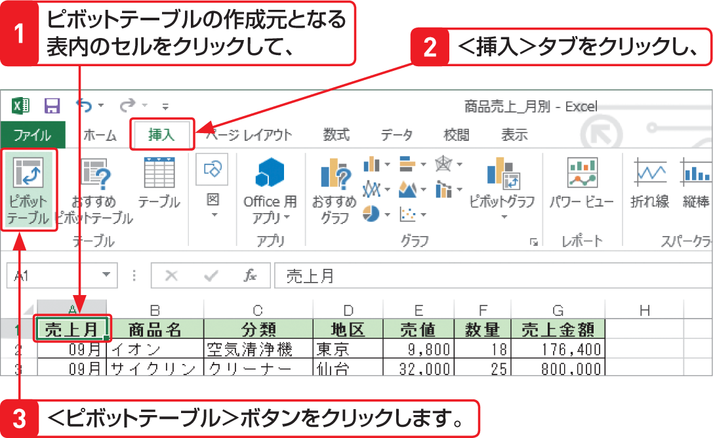

# Section 71 ピボットテーブルとグラフを作成する

## 新規ワークシートにピボットテーブルを作成する

### [Hint] そのほかのピボットテーブルの作成方法

Excel 2013では、＜挿入＞タブの＜テーブル＞グループにある＜おすすめピボットテーブル＞ボタンを利用してもピボットテーブルを作成することができます。ボタンをクリックすると＜おすすめピボットテーブル＞ダイアログボックスが表示されるので、目的のピボットテーブルを選択します。  
また、ピボットテーブルにする範囲を選択すると右下に表示される＜クイック分析＞ボタン  をクリックし、＜テーブル＞から目的のピボットテーブルを作成することもできます。
