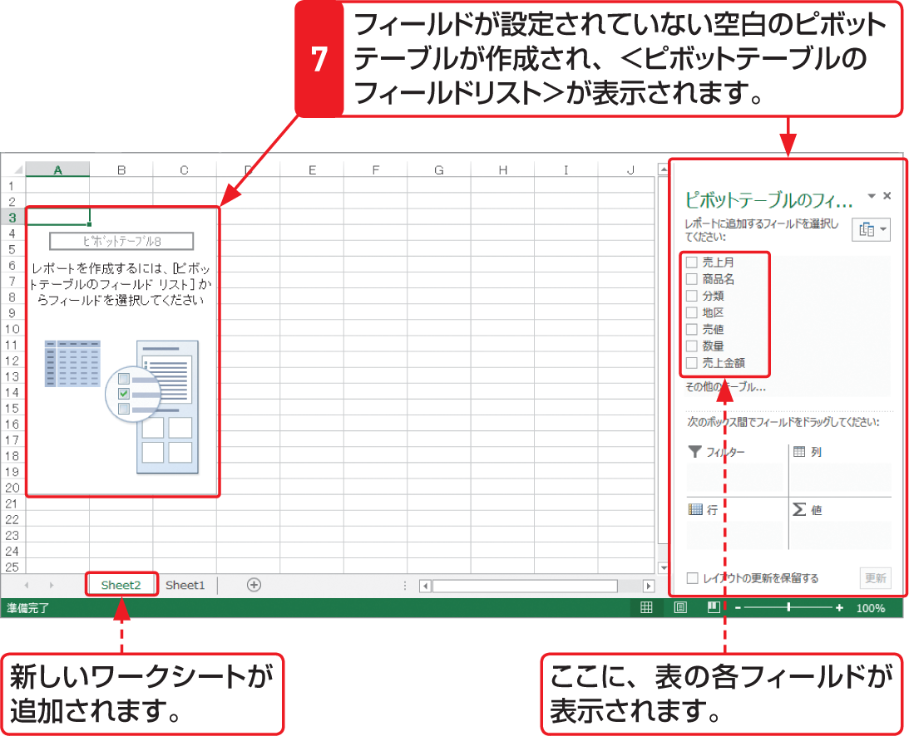

# Section 71 ピボットテーブルとグラフを作成する

## 新規ワークシートにピボットテーブルを作成する

### [Memo] ピボットテーブルのフィールドリスト

ピボットテーブルは、空のピボットテーブルのフィールドに、データベースの各フィールドを配置することで作成できます。フィールドを配置するには、次の3つの方法があります。

&#9312; ＜ピボットテーブルのフィールドリスト＞ で、表示するフィールド名にチェックを付けて既定の領域に追加し、適宜移動する。  
&#9313; フィールド名を右クリックして、追加したい領域をクリックする。  
&#9314; フィールドをピボットテーブルの目的領域にドラッグする。
