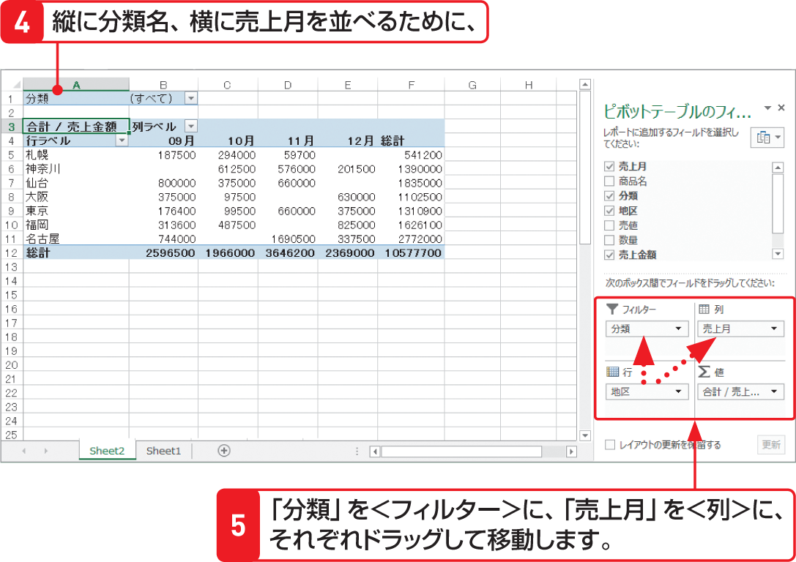

# Section 71 ピボットテーブルとグラフを作成する

## 空のピボットテーブルにフィールドを配置する

### [Memo] 列ラベルフィールド

＜列ラベル＞フィールドは、ピボットテーブルの横方向に「列ラベル」として表示されます。＜列＞フィールドのアイテムは、ピボットテーブルの列見出し名として表示されます。

### [Memo] レポートフィルターフィールド

＜レポートフィルター＞フィールドは、ピボットテーブルの上にトップレベルレポートフィルターとして表示されます。レポートフィルターのアイテムを切り替えて、アイテムごとの集計結果を簡単に表示できます。