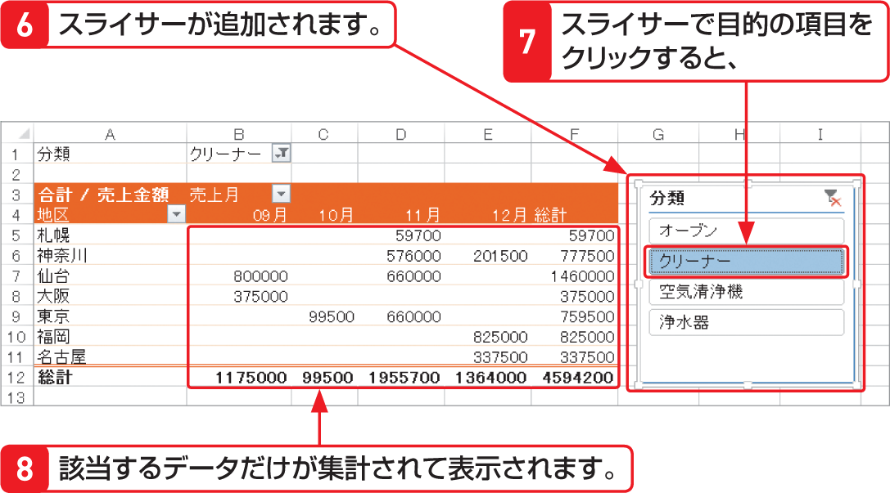
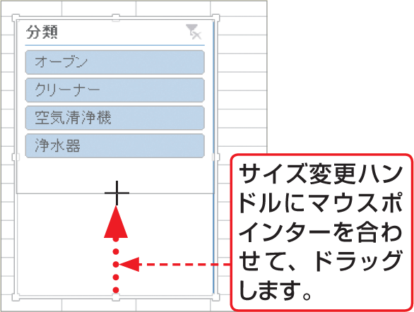

# Section 71 ピボットテーブルとグラフを作成する

## スライサーを追加する

### [Hint] スライサーのサイズを変更する／移動する

スライサーの大きさを変更するには、スライサーをクリックし、周囲に表示されるサイズ変更ハンドルにマウスポインターを合わせてドラッグします。また、スライサーを移動するには、スライサーにマウスポインターを合わせ、ポインターの形が  に変わった状態でドラッグします。

